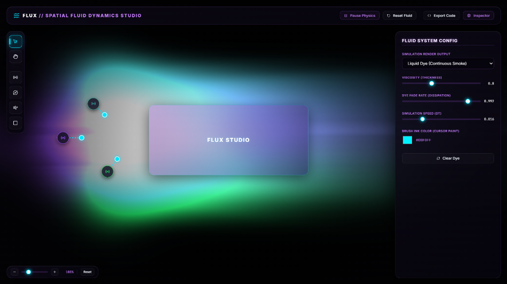

# 🌌 FLUX // Spatial Fluid Dynamics Studio

[](https://react.dev/)
[](https://vite.dev/)
[](https://developer.mozilla.org/en-US/docs/Web/API/WebGL2RenderingContext)
[](https://eslint.org/)
[](https://vitest.dev/)

🔗 **Live Website**: [flux-fluid-studio.vercel.app](https://flux-fluid-studio.vercel.app/)



**FLUX** is an interactive, WebGL2-powered 2D spatial sandbox where UI design meets real-time fluid dynamics. Designers and developers can sketch, drag, configure, and place fluid interaction nodes (Emitters, Vortexes, Wind Tunnels) alongside pre-styled glassmorphic UI components on an infinite canvas, then compile the entire system into standalone HTML/GLSL, React hooks, or lightweight fallback configurations in a single click.

---

## ✨ Key Capabilities

* **60fps Fluid Simulation**: Solves the incompressible Navier-Stokes equations in real-time using custom double-buffered WebGL2 texture pipelines.
* **Interactive Boundary Colliders**: Automatically maps any glassmorphic DOM cards, headers, or buttons to an offscreen Canvas2D mask, enabling the fluid simulator to treat your UI components as real physical colliders.
* **Spatial Canvas & Controls**: Middle-mouse panning, mouse wheel zoom, and drag-and-drop vector gizmos to intuitively adjust fluid force, width, height, and sweep angles.
* **Glassmorphic Design Engine**: Fine-tune backdrop blurs, double-bevel borders, gradient backplanes, content alignment, and glowing ambient drop-shadows on cards.
* **One-Click Code Exporter**: Generate production-ready snippets (responsive standalone HTML page with embedded GLSL shaders, React Canvas hooks, or lightweight fallbacks).

---

## 🏗️ Codebase Architecture

```
flux/
├── src/
│   ├── components/
│   │   ├── Canvas.jsx          # Interactive Grid, WebGL mount, and coordinate helpers
│   │   ├── CanvasCards.jsx     # Glassmorphic obstacle cards and control handles
│   │   ├── CanvasOverlay.jsx   # SVG directional vector overlays (emitter sweeps, wind lines)
│   │   ├── Compiler.jsx        # Exporter generating HTML/CSS/GLSL build code
│   │   ├── Inspector.jsx       # Side-panel controls for global physics and element details
│   │   └── inspector/          # Specialized sub-inspectors (Emitter, Obstacle, Vortex, Wind Tunnel)
│   ├── utils/
│   │   ├── fluidSolver.ts      # Navier-Stokes WebGL2 pipeline (Advection, Jacobi, Divergence)
│   │   ├── splatFunctions.ts   # Pure render functions to paint emitters/obstacles/drag actions
│   │   ├── color.ts            # Consolidated hex, RGB, and RGBA helper libraries
│   │   └── cardStyles.ts       # Styles resolver parsing obstacle configs to CSS
│   ├── types/
│   │   └── nodes.d.ts          # Strongly typed definitions for spatial simulation elements
│   ├── App.jsx                 # Global state manager and UI container
│   └── main.jsx                # Application mount point
├── tsconfig.json               # TypeScript configuration
├── eslint.config.js            # Linter rules and compiler setup
├── vite.config.js              # Vite packaging config
└── package.json                # Project dependencies
```

---

## 🧬 Fluid Dynamics Simulation Loop

The simulator runs an iterative, multi-stage pipeline directly on the GPU for maximum performance:

1. **Obstacle Update**: Draws active obstacle paths (`collider: true`) to a low-res mask texture.
2. **Splatting**: injects dye density and velocity vector impulses (from constant Emitters, Wind Tunnels, or mouse sweeps).
3. **Advection**: Move velocity and dye along the flow field using semi-Lagrangian advection (attenuated by viscosity/dissipation parameters).
4. **Divergence**: Computes flow divergence to prepare for the pressure correction step.
5. **Jacobi Iteration**: Iteratively solves the Poisson equation (pressure relaxation) to enforce zero divergence (incompressibility).
6. **Gradient Subtraction**: Corrects velocity fields by subtracting pressure gradients.
7. **Render**: Draws dye density (blended underneath glassmorphic elements using custom alpha setups) to the display canvas.

---

## 🛠️ Getting Started

### Prerequisites
Make sure you have [Node.js](https://nodejs.org/) installed (v18+ recommended).

### Install dependencies
```bash
npm install
```

### Start Local Development Server
```bash
npm run dev
```
Open **[http://localhost:5173](http://localhost:5173)** in your browser to interact with the studio.

### Run Verification & Unit Tests
```bash
# Run ESLint linter
npm run lint

# Run Vitest test suite
npm run test
```

### Build for Production
```bash
npm run build
```
Production assets will be built in the `dist/` directory.

---

## 📜 License
This project is private and proprietary. All rights reserved.
